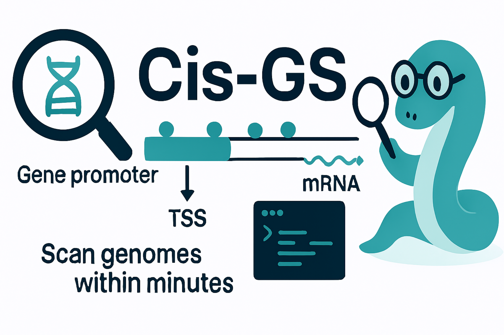

# Cis-GS : Cis-element Genome Scanner
* Biopython-based All-in-One Tool
# Source Code Structure and Execution Order

This directory contains all source code used for genome-wide cis-regulatory
element discovery, transcriptomic filtering, coexpression network analysis,
and functional annotation of **CYCLOPS-associated genes**.

Scripts are organised into **numbered subdirectories**, reflecting the
recommended execution order of the full analysis pipeline. Each module produces
outputs that are consumed by downstream analyses.

This structure enables **full computational reproducibility** of all results
reported in the manuscript.

---

## Execution Order Overview

Scripts should be executed **sequentially**, following the numerical order of
the directories listed below.

Downstream analyses depend on outputs generated in earlier steps. Individual
modules can be rerun independently if their required inputs are present.

---

## 01_data_preprocessing/

### Purpose
Prepare genome annotations and retrieve sequence data required for promoter
analysis, cis-element scanning, and cross-species comparisons.

01_data_preprocessing

### Outputs
- Processed genome annotation files  
- Promoter FASTA sequences  
- Transcript and CDS FASTA files  

---

## 02_cis_element_detection/

### Purpose
Identify cis-regulatory elements in promoter regions using motif-based searches
and positional mapping.

### Key scripts
- `build_motif_variants.py`  
  Generates motif variants for degenerate cis-elements.
- `scan_cis_elements.py`  
  Scans promoter sequences for motif occurrences.
- `map_genomic_coordinates.py`  
  Maps motif hits to genomic coordinates and associated genes.

### Outputs
- CSV tables of cis-element positions  
- Gene–motif association files  

---

## 03_pwm_analysis/

### Purpose
Quantify cis-element binding strength using **Position Weight Matrices (PWM)**
and evaluate motif enrichment across candidate genes.

### Key scripts
- `build_pwm.py`  
  Constructs PWMs from aligned cis-element instances and generates
  publication-quality sequence logos.
- `pwm_scoring.py`  
  Computes PWM log-likelihood scores for motif matches in promoter sequences.
- `pwm_kde_plots.py`  
  Visualises PWM score distributions using kernel density estimation.
- `pwm_summary_tables.py`  
  Generates statistical summaries of PWM scores for supplementary tables.
- `pwm_frequency_tables.py`  
  Exports PWM frequency matrices for supplementary material.

### Outputs
- PWM frequency tables (CSV)  
- PWM score tables (CSV)  
- Motif sequence logos (PNG)  
- PWM score distribution plots (PNG)  

---

## 04_expression_analysis/

### Purpose
Analyse RNA-seq datasets and identify differentially expressed genes following
inoculation, including cross-species transcriptomic comparisons.

### Key analyses implemented
- Transcript quantification (Kallisto-based)
- TPM-based expression comparison
- Log2 fold-change estimation
- Differential expression filtering
- Cross-species BLAST-based gene mapping

### Representative scripts
- `kallisto_quantification.py`
- `tpm_log2fc_analysis.py`
- `deg_classification.py`
- `blast_cross_species_mapping.py`
- `arachis_deg_analysis.py`

### Outputs
- Differentially expressed gene (DEG) lists  
- TPM and log2FC expression tables  
- Cross-species orthologue mappings  

---

## 05_coexpression_analysis/

### Purpose
Construct and analyse **coexpression networks** to identify genes
co-regulated with **CYCLOPS** across time-course expression data.

### Key analyses implemented
- Expression matrix cleaning and harmonisation
- Pearson correlation–based coexpression
- WGCNA-like Topological Overlap Matrix (TOM) analysis
- CYCLOPS-centered coexpression networks
- Louvain community (module) detection

### Representative scripts
- `prepare_expression_matrix.py`
- `build_coexpression_matrix.py`
- `network_analysis.py`
- `network_plots.py`

### Outputs
- Cleaned expression matrices  
- Coexpression and TOM matrices  
- Network graphs  
- Module (cluster) assignments  
- Gene cluster tables  

---

## 06_functional_annotation/

### Purpose
Assign functional annotations to shortlisted genes using sequence similarity
and database-based annotations.

### Key scripts
- `blast_search.py`  
  Performs sequence similarity searches against reference databases.
- `annotation_summary.py`  
  Integrates functional annotations across modules.
- `export_modules.py`  
  Exports module-wise gene annotation tables.

### Outputs
- Annotated gene tables  
- Functional enrichment summaries  

---

## 07_visualisation/

### Purpose
Generate **publication-quality figures** for transcriptomic, cis-regulatory,
and network analyses.

### Key scripts
- `gene_level_visualisation.py`
- `network_plots.py`
- `figure_exports.py`

### Outputs
- Figures used directly in the manuscript  
- High-resolution PNG and SVG files suitable for publication  

---

## Notes

- Not all scripts are required to reproduce every figure; exploratory and
  parameter-testing steps are retained for transparency.
- All major figures and tables in the manuscript can be traced to specific
  scripts within this repository.
- File paths in scripts are relative and assume execution from the repository
  root unless otherwise specified.
- This repository is designed to support **full reproducibility** and long-term
  archival (e.g., Zenodo DOI assignment).

---

## License

This project is licensed under the MIT License.  
See the `LICENSE` file for details.

---
