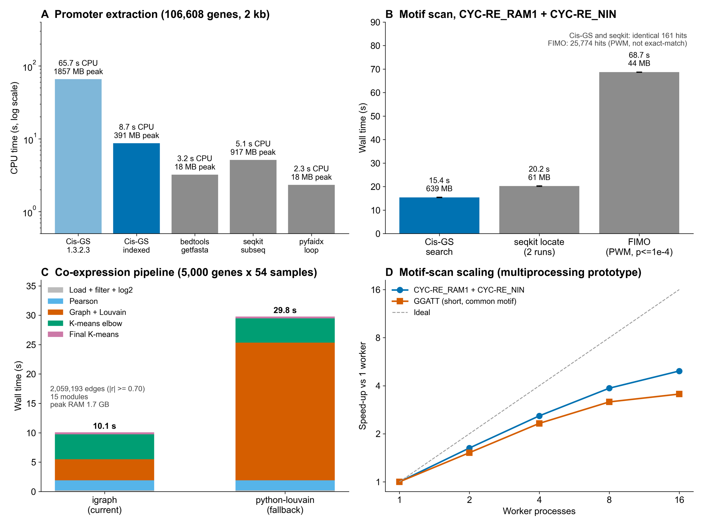

Performance
===========

Cis-GS was benchmarked on the *Arachis hypogaea* Tifrunner genome
(2.6 Gb, 106,608 annotated genes, 2 kb promoters) on one machine: Intel Core
i5-14450HX (16 logical cores), 18 GB RAM, WSL2 Ubuntu. Every measurement is a
fresh process, three repetitions, warm file cache; peak memory is the
operating system's maximum resident set size. Reference tools: bedtools 2.31.1,
seqkit 2.14.0, samtools 1.24, pyfaidx 0.9.0.4, MEME Suite 5.5.9.

Resources per step
------------------

.. list-table::
   :header-rows: 1
   :widths: 30 26 14 12 18

   * - Step
     - Tool
     - Wall time
     - Peak RAM
     - Note
   * - Promoter extraction
     - Cis-GS 1.3.2.4 (indexed)
     - 4.9 s
     - 0.39 GB
     - includes GFF3 parse; 20.8 s on a cold first read
   * -  
     - Cis-GS 1.3.2.3
     - 62.7 s
     - 1.86 GB
     - loaded whole chromosomes
   * -  
     - bedtools getfasta
     - 1.8 s CPU
     - 18 MB
     - plus 1.4 s BED, one-off ``samtools faidx``
   * -  
     - seqkit subseq
     - 3.7 s CPU
     - 0.92 GB
     -  
   * -  
     - pyfaidx loop
     - 0.9 s CPU
     - 18 MB
     -  
   * - Motif scan (2 motifs, incl. significance)
     - Cis-GS
     - 15.4 s
     - 0.64 GB
     - 161 hits
   * -  
     - seqkit locate -d (2 runs)
     - 20.2 s
     - 61 MB
     - 161 hits (identical)
   * -  
     - FIMO, p <= 1e-4
     - 68.7 s
     - 44 MB
     - 25,774 PWM hits (different question)
   * - Short motif stress test (GGATT)
     - Cis-GS
     - 13.0 s
     - 1.18 GB
     - 442,811 hit rows
   * - Co-expression pipeline (5,000 genes x 54 samples)
     - Cis-GS (igraph)
     - 10.1 s
     - 1.67 GB
     - 2.06 M edges, 15 modules
   * -  
     - Cis-GS (python-louvain fallback)
     - 29.8 s
     - 1.78 GB
     -  

Notes
-----

* **Extraction output is identical** across Cis-GS, bedtools, seqkit and
  pyfaidx (same 106,608 sequences).
* bedtools and pyfaidx remain faster at pure interval extraction; Cis-GS
  additionally parses the GFF3 and writes the promoter table used by later steps.
* **Cores:** extraction and motif scanning run on one core. The co-expression
  step uses several cores inside NumPy / scikit-learn (about five on average).
  A multiprocessing prototype of the scan reached 4.9x at 16 workers; it is
  not part of the release.
* **Memory:** every step stayed under 2 GB, so the workflow runs on an
  8 GB laptop.
* FIMO is listed for timing only: it scores position weight matrices and
  accepts mismatches, whereas Cis-GS matches IUPAC consensus patterns.
